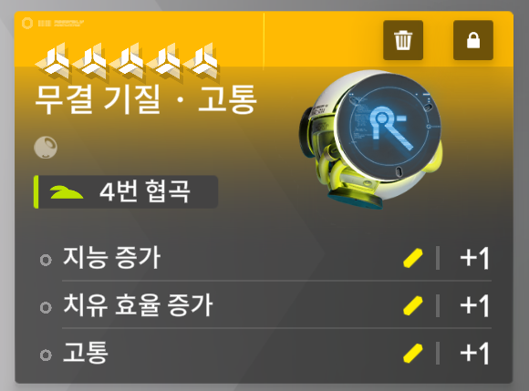
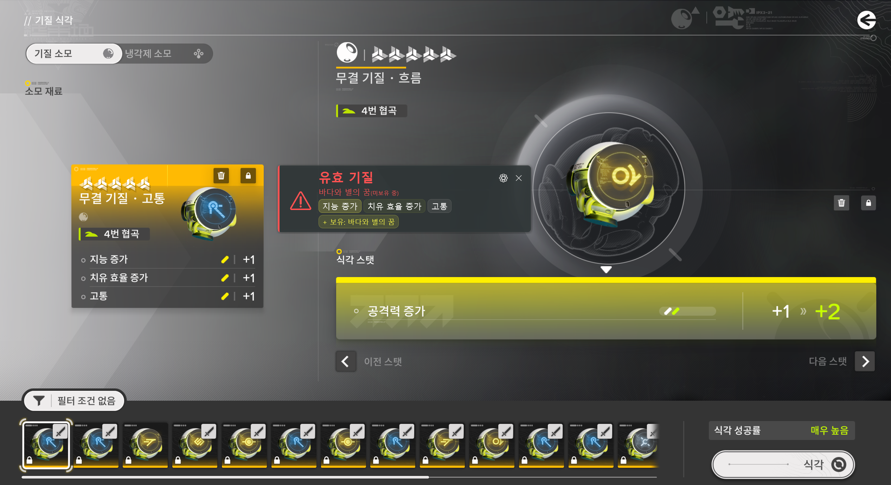

# 명일방주 엔드필드 — 기질 오버레이

게임 화면에서 기질 키워드를 실시간 템플릿 매칭으로 인식하고, 유효/보유 여부를 오버레이로 표시해 주는 Windows 데스크탑 툴입니다.

> 대응 버전: 엔드필드 v1.0

## 요구사항

- Windows 10 1809 이상
- 관리자 권한 (게임 캡처를 위해 자동으로 요청됩니다)

## 사용법

1. `EndfieldEssenceOverlay.exe`를 실행합니다
2. 캡처 영역 설정 창이 열리면 아래와 같이 기질 3개가 표시되는 패널을 드래그로 선택해 주세요

   

3. 게임에서 기질 패널을 열면 오버레이가 자동으로 갱신됩니다

   

.NET 런타임 등 별도 설치 없이 바로 실행할 수 있습니다.

## 오버레이 상태

| 상태 | 의미 |
|------|------|
| 🔄 회색 | 스캔중입니다 (대기) |
| ✅ 초록 | 비유효 기질이거나 보유 중인 기질입니다 |
| ⚠️ 빨강 | 유효 기질이나 미보유 상태입니다 → `[+ 보유]` 버튼으로 등록할 수 있습니다 |

## 단축키

| 키 | 동작 |
|----|------|
| F8 | 캡처 범위를 재설정합니다 |

## 설정

`⚙` 버튼을 클릭하면 설정 창이 열립니다:

- **설정 탭** — 디버그 토글, 캡처 주기, 오버레이 불투명도, 캡처 영역 재설정
- **보유 목록 탭** — 무기별 보유 여부를 체크하고 저장/초기화할 수 있습니다
- **도움말 탭** — 사용법 안내를 확인하실 수 있습니다

## 데이터 파일

```
Data/
  weapons.json                무기 & 기질 조합 데이터
  owned.json                  보유 무기 목록 (앱이 자동으로 관리합니다)
  calibration.json            캡처 영역 설정 (앱이 자동으로 관리합니다)
  templates/
    attribute/                힘 증가, 민첩 증가, ...
    secondary/                공격력 증가, 생명력 증가, ...
    skill/                    강공, 고통, 골절, ...
```

### 템플릿 추가 방법

1. 게임에서 기질 패널이 보이는 상태로 스크린샷을 찍습니다
2. 키워드 텍스트만 타이트하게 크롭합니다 (여백 ~5px)
3. `Data/templates/{attribute|secondary|skill}/키워드.png`로 저장합니다 (파일명 = 키워드, `_` → 공백)

## 기술 스택

- C# 12 / .NET 8 / WPF
- OpenCvSharp4 — 멀티스케일 NCC 템플릿 매칭
- MahApps.Metro — 설정 창 UI
- FuzzySharp — 퍼지 키워드 스냅
- GDI+ CopyFromScreen — 화면 캡처

## 주의사항

- 이 프로그램은 오픈소스이며 무료입니다. 학습 및 커뮤니케이션 목적으로 제공됩니다.
- 본 프로그램을 이용하여 유료 서비스를 제공하는 제3자로 인해 발생하는 문제에 대해 개발자는 책임지지 않습니다.
- 본 프로그램은 명일방주: 엔드필드의 공식 툴이 아니며, Hypergryph/Gryphline과 무관합니다.

## 라이선스

MIT
